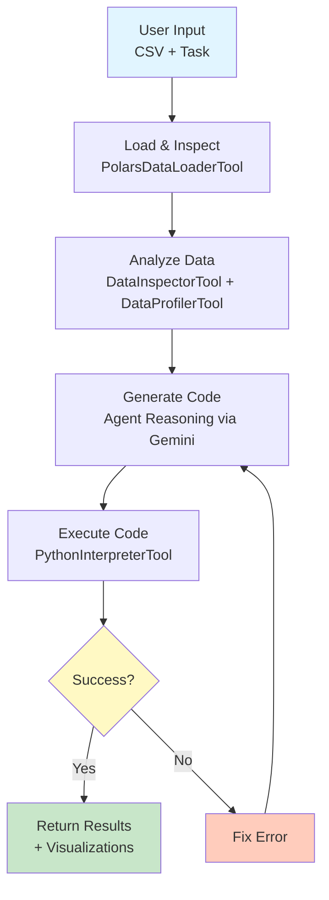

<div align="center">

# Polars Analyst Agent

An AI-powered data analysis agent that inspects real CSV data and generates tailored Polars analysis code.

[](https://python.org)
[](https://github.com/huggingface/smolagents)
[](https://opensource.org/licenses/MIT)

Built with [smolagents](https://github.com/huggingface/smolagents) · [Gemini API](https://ai.google.dev) · [Polars](https://pola.rs)

[Features](#features) · [Quick Start](#quick-start) · [How It Works](#how-it-works) · [Project Structure](#project-structure)

</div>

---

## Features

### CSV Loading

- Auto-detects encoding (UTF-8, Latin-1, ISO-8859-1)
- Auto-detects separators (comma, semicolon, tab, pipe)
- Gracefully handles malformed files

### Data Inspection & Profiling

- Analyzes schema, null counts, and unique values
- Classifies columns as numeric, categorical, or text
- Computes distributions, correlations, and outliers

### Code Generation & Execution

- Generates Polars code tailored to the actual data structure
- Adapts null handling based on what the inspector finds
- Runs generated code in a sandboxed environment with whitelisted imports
- Reads execution errors and self-corrects automatically (up to 12 iterations)

### Visualization

- Generates matplotlib/seaborn plots based on data characteristics
- Saves all visualizations as PNG files

---

## Quick Start

### Setup

```bash
git clone git@github.com:Ioannis-Stamatakis/polars-analyst-agent.git
cd polars-analyst-agent

python -m venv venv
source venv/bin/activate  # Windows: venv\Scripts\activate

pip install -r requirements.txt

cp .env.example .env
# Add your GEMINI_API_KEY to .env — get one at https://ai.google.dev/
```

### Run from CLI

```bash
# Default exploratory analysis
python -m src.agent_controller examples/sample_datasets/sales_data.csv

# Specific task
python -m src.agent_controller examples/sample_datasets/sales_data.csv \
  --task "Show which region has the highest sales"

# Analyze your own data
python -m src.agent_controller your_data.csv \
  --task "Find correlations between columns"

# Verbose mode — see agent reasoning at each step
python -m src.agent_controller your_data.csv --verbose
```

### Use as a Library

```python
from src.agent_controller import DataAnalysisAgent

agent = DataAnalysisAgent()  # reads GEMINI_API_KEY from .env

result = agent.analyze(
    csv_path="data/sales.csv",
    task="Show sales trends and regional performance"
)

print(result)
```

---

## How It Works

### Agent Loop



### Step by Step

1. **Load** — CSV is loaded with automatic encoding and separator detection
2. **Inspect** — Schema, data types, nulls, and unique values are analyzed
3. **Profile** — Distributions, correlations, and outliers are computed
4. **Generate** — Polars code is written based on actual data findings
5. **Execute** — Code runs in a sandbox; output and errors are captured
6. **Recover** — If an error occurs, the traceback is read and code is regenerated
7. **Return** — Final results include insights and saved visualizations

### Dynamic Adaptation

The agent adjusts its approach based on what it discovers in the data:

| Data characteristic | Agent behavior |
|:---|:---|
| Date columns present | Generates time series analysis |
| Low-cardinality strings | Uses group-by aggregations |
| Null values detected | Adds appropriate null handling |
| Multiple numeric columns | Computes and visualizes correlations |

---

## Project Structure

```
polars-analyst-agent/
├── src/
│   ├── agent_controller.py          # Orchestration, CLI, retry logic
│   ├── tools/
│   │   ├── data_loader.py           # CSV loading with encoding/separator detection
│   │   ├── data_inspector.py        # Schema, types, null analysis
│   │   ├── data_profiler.py         # Distributions, correlations, outliers
│   │   └── data_validator.py        # Data quality checks & fix recommendations
│   ├── prompts/
│   │   └── system_prompts.py        # Agent behavior instructions
│   ├── execution/
│   │   └── authorized_imports.py    # Sandboxed import whitelist
│   ├── memory/
│   │   └── compact_memory.py        # Observation truncation for token efficiency
│   └── formatters/
│       └── result_formatter.py      # Rich CLI output
├── tests/
│   ├── test_tools.py                # 38 unit tests — tools & memory (no API)
│   └── test_agent_live.py           # 13 end-to-end tests against Gemini
├── examples/
│   ├── sample_datasets/
│   │   ├── sales_data.csv           # 25 rows — sales with nulls
│   │   ├── customer_data.csv        # 25 rows — demographics with nulls
│   │   └── employee_data.csv        # 25 rows — HR data, no nulls
│   └── example_usage.py
├── requirements.txt
├── .env.example
└── README.md
```

---

## Testing

```bash
# Unit tests — fast, no API calls
venv/bin/pytest tests/test_tools.py -v

# Live end-to-end tests — hits Gemini, runs full agent loop on all 3 datasets
venv/bin/pytest tests/test_agent_live.py -v
```

The live tests cover 13 scenarios across all sample datasets: null handling, correlations, categorical grouping, scatter plots, and multi-visualization tasks. Each test runs the full agent loop end-to-end. A summary table prints after the run showing steps consumed, wall-clock time, and whether a PNG was saved per test.

---

## Example Output

```
→ Starting Analysis
  File: examples/sample_datasets/sales_data.csv

[Agent loads data...]
Shape: 25 rows, 6 columns
Columns: date, product, region, sales_amount, units_sold, customer_type

[Agent inspects...]
Found 2 nulls in sales_amount
Identified 2 numeric, 4 categorical columns

[Agent profiles...]
Correlation: units_sold ↔ sales_amount (r=0.87)

[Agent generates & executes code...]
✓ Code executed successfully

╭─────────────────────────────────╮
│      Analysis Complete          │
╰─────────────────────────────────╯

Generated visualizations:
  • sales_by_region.png
  • product_revenue.png
  • correlation_matrix.png

Key Insights:
  • Widget C: highest revenue ($14,631)
  • North region: best performing
  • Strong units-revenue correlation
```

---

## Tech Stack

| Technology | Role |
|:-----------|:-----|
| [smolagents](https://github.com/huggingface/smolagents) | Agent framework & tool orchestration |
| [LiteLLM](https://github.com/BerriAI/litellm) | Unified LLM API interface |
| [Gemini 2.5 Flash](https://ai.google.dev) | Generative AI model |
| [Polars](https://pola.rs) | High-performance DataFrames |
| [Matplotlib](https://matplotlib.org) / [Seaborn](https://seaborn.pydata.org) | Visualizations |
| [Rich](https://github.com/Textualize/rich) | CLI formatting |

---

## Contributing

Potential extensions:

- SQL database support
- Streaming data analysis
- Advanced visualization options
- Multi-file comparisons
- PDF report generation
- Excel / JSON / Parquet support

---

## Acknowledgments

- [smolagents](https://github.com/huggingface/smolagents) by Hugging Face
- [LiteLLM](https://github.com/BerriAI/litellm) by BerriAI
- [Polars](https://pola.rs) by Ritchie Vink
- [Gemini](https://ai.google.dev) by Google

---

## License

MIT
