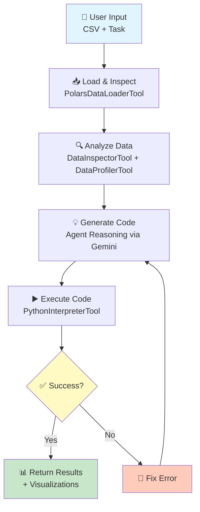

<div align="center">

# 🔍 Polars Analyst Agent

**AI-powered data analysis agent that inspects real CSV data and generates tailored Polars analysis code.**

[](https://python.org)
[](https://github.com/huggingface/smolagents)
[](https://opensource.org/licenses/MIT)

Built with [smolagents](https://github.com/huggingface/smolagents) • [Gemini API](https://ai.google.dev) • [Polars](https://pola.rs)

[Features](#-features) • [Quick Start](#-quick-start) • [How It Works](#-how-it-works) • [Documentation](#-project-structure)

</div>

---

## 🎯 The Problem

Most AI coding tools generate code **blindly**:

<table>
<tr>
<td width="50%">

### ❌ Traditional LLM Approach
```
User: "Analyze my data"
  ↓
LLM generates generic code
  ↓
Assumes column names
Assumes data types
Assumes no nulls
  ↓
User runs code → Often fails ❌
User debugs → Wastes time 😞
```

</td>
<td width="50%">

### ✅ Agent Approach (This Project)
```
User: "Analyze my data"
  ↓
Agent loads & inspects CSV
Agent discovers actual columns
Agent detects nulls, types
  ↓
Generates tailored code
Executes in sandbox
Handles errors automatically
  ↓
Returns working results ✨
```

</td>
</tr>
</table>

## 🚀 What Makes This Agentic?

<div align="center">

| Feature | LLM Only | This Agent |
|:--------|:--------:|:----------:|
| **Data Awareness** | Blind guessing 🙈 | Inspects actual CSV 🔍 |
| **Code Execution** | User must run 👤 | Automatic sandbox ⚡ |
| **Error Handling** | User debugs 🐛 | Self-corrects 🔄 |
| **Tool Usage** | None 🚫 | 3 custom tools 🛠️ |
| **Validation** | No verification ❓ | Validates before return ✅ |
| **Iteration** | One-shot 1️⃣ | Loops until success 🔁 |

</div>

**Result:** Code that **actually works** on YOUR data, not generic boilerplate.

---

## ✨ Features

### Core Capabilities

🔧 **Robust CSV Loading**
- Auto-detects encoding (UTF-8, Latin-1, ISO-8859-1)
- Auto-detects separators (comma, semicolon, tab, pipe)
- Handles malformed CSVs gracefully

📊 **Intelligent Data Inspection**
- Analyzes schema without assumptions
- Detects null counts and unique values
- Classifies column types (numeric, categorical, temporal)

🧮 **Deep Data Profiling**
- Computes statistics and distributions
- Detects correlations and outliers
- Recommends appropriate visualizations

🤖 **Smart Code Generation**
- Generates Polars code tailored to actual data
- Adapts based on discovered characteristics
- Includes null handling based on findings

🔒 **Safe Execution**
- Sandboxed Python environment
- Whitelisted imports only
- Captures errors and output

♻️ **Error Recovery**
- Reads execution errors
- Understands the issue
- Regenerates and retries automatically

📈 **Automatic Visualization**
- Creates matplotlib/seaborn plots
- Saves results to PNG files

### Why This Matters for Portfolios

✅ **Production-Ready**: Shows understanding of agentic AI patterns
✅ **Tool Integration**: Custom tool creation with smolagents
✅ **Error Handling**: Real feedback loops and self-correction
✅ **Security**: Sandboxed execution with import whitelisting
✅ **Extensibility**: Clean architecture for adding tools

---

## 🏃 Quick Start

### 1️⃣ Setup

```bash
# Clone repository
git clone git@github.com:Ioannis-Stamatakis/polars-analyst-agent.git
cd polars-analyst-agent

# Create virtual environment
python -m venv venv
source venv/bin/activate  # Windows: venv\Scripts\activate

# Install dependencies
pip install -r requirements.txt

# Configure API key
cp .env.example .env
# Edit .env and add your GEMINI_API_KEY from https://ai.google.dev/
```

### 2️⃣ Run Example

```bash
# Analyze sample sales data
python -m src.agent_controller examples/sample_datasets/sales_data.csv

# Or with specific task
python -m src.agent_controller examples/sample_datasets/sales_data.csv \
  --task "Show which region has highest sales"
```

### 3️⃣ Analyze Your Data

```bash
# Simple usage
python -m src.agent_controller your_data.csv

# Custom task
python -m src.agent_controller your_data.csv \
  --task "Find correlations between columns"

# Verbose mode (see agent reasoning)
python -m src.agent_controller your_data.csv --verbose
```

### 4️⃣ Use as Library

```python
from src.agent_controller import DataAnalysisAgent

agent = DataAnalysisAgent()  # Uses GEMINI_API_KEY from .env

result = agent.analyze(
    csv_path="data/sales.csv",
    task="Show sales trends and regional performance"
)

print(result)
```

---

## 🔄 How It Works

### The Agent Loop



<details>
<summary><b>📋 Step-by-Step Process</b></summary>

1. **Load & Inspect** - Agent loads CSV, detects encoding, gets schema
2. **Analyze** - Computes statistics, correlations, distributions, outliers
3. **Generate** - Writes Polars code based on ACTUAL data findings
4. **Execute** - Runs code in sandbox, captures output and errors
5. **Validate** - If error occurs, reads traceback and regenerates
6. **Return** - Provides working code + visualizations + insights

*Max 8 iterations for efficiency*

</details>

---

## 🏗️ Architecture

```
src/
├── 🎮 agent_controller.py       # Main orchestration & CLI
├── 🛠️ tools/
│   ├── data_loader.py           # CSV loading with auto-detection
│   ├── data_inspector.py        # Schema & null analysis
│   └── data_profiler.py         # Statistical profiling
├── 🔒 execution/
│   └── authorized_imports.py    # Safe execution whitelist
├── 🎨 formatters/
│   └── result_formatter.py      # Rich CLI output
└── 💬 prompts/
    └── system_prompts.py        # Agent behavior instructions
```

---

## 📦 Project Structure

```
polars-analyst-agent/
├── 📄 README.md                     # This file
├── 📋 requirements.txt              # Dependencies
├── 🔐 .env.example                  # API key template
│
├── 🧠 src/                          # Core agent code
│   ├── agent_controller.py
│   ├── tools/
│   ├── execution/
│   ├── formatters/
│   └── prompts/
│
├── 📚 examples/                     # Example usage
│   ├── sample_datasets/
│   │   ├── sales_data.csv          # 25 rows, sales data (mixed types)
│   │   ├── customer_data.csv       # 25 rows, customer demographics
│   │   └── employee_data.csv       # 30 rows, heavy categorical
│   └── example_usage.py
│
├── 🧪 tests/                        # Integration tests
│   └── test_integration.py
│
└── 📊 outputs/                      # Generated results
    ├── code/
    ├── visualizations/
    └── reports/
```

---

## 🎓 Why This Showcases smolagents Mastery

### 1. **Tool Orchestration & Planning**
Agent follows intelligent sequence: `Load → Inspect → Profile → Generate → Execute → Validate`

This demonstrates **multi-step reasoning**, not just prompt engineering.

### 2. **Execution Feedback Loop** *(Core of Agentic AI)*

<table>
<tr>
<td width="50%">

**Traditional LLM**
```
Prompt
  ↓
Generate code
  ↓
(User runs it)
  ↓
Might fail ❌
User debugs
```

</td>
<td width="50%">

**This Agent**
```
Load data
  ↓
Analyze
  ↓
Generate
  ↓
Execute
  ↓
Error? → Fix → Re-execute ✅
```

</td>
</tr>
</table>

Agent **learns from execution results** - that's what makes it an agent.

### 3. **Dynamic Decision Making**

Agent adapts code based on what it discovers:
- **Date columns** → Time series analysis
- **Categorical** → Group-by aggregations
- **Nulls detected** → Null handling logic
- **Correlations** → Correlation visualizations

**Grounded reasoning**, not templated code.

### 4. **Safe Execution**
- ✅ Sandboxed environment
- ✅ Whitelisted imports
- ✅ Error capture & handling
- ✅ Security best practices

### 5. **Custom Tool Development**

Not just using defaults - creates 3 domain-specific tools:
- `PolarsDataLoaderTool` - CSV loading expertise
- `DataInspectorTool` - Schema analysis
- `DataProfilerTool` - Statistical profiling

Shows ability to **extend smolagents** framework.

---

## ✅ Verification

```bash
# Test with sample data
python -m src.agent_controller examples/sample_datasets/sales_data.csv

# Try different data (notice how analysis changes)
python -m src.agent_controller examples/sample_datasets/customer_data.csv

# Run tests
python -m pytest tests/ -v
```

**What to verify:**
1. ✅ Agent inspects data first (not blind generation)
2. ✅ Different CSVs get different analysis
3. ✅ Errors are automatically fixed
4. ✅ Visualizations created (PNG files)
5. ✅ Uses Polars, respects safety constraints

---

## 📊 Example Output

```
→ Starting Analysis
  File: examples/sample_datasets/sales_data.csv

[Agent loads data...]
Shape: 25 rows, 6 columns
Columns: date, product, region, sales_amount, units_sold, customer_type

[Agent inspects...]
Found 2 nulls in sales_amount
Identified 2 numeric, 4 categorical columns

[Agent profiles...]
Correlation: units_sold ↔ sales_amount (r=0.87)
Recommends: time series, bar charts, heatmap

[Agent generates & executes code...]
✓ Code executed successfully

╭─────────────────────────────────╮
│      Analysis Complete          │
╰─────────────────────────────────╯

📊 Generated visualizations:
  • sales_by_region.png
  • product_revenue.png
  • correlation_matrix.png

💡 Key Insights:
  • Widget C: highest revenue ($14,631)
  • North region: best performing
  • Strong units-revenue correlation
```

---

## 🛠️ Tech Stack

| Technology | Purpose |
|:-----------|:--------|
| [smolagents](https://github.com/huggingface/smolagents) | Agent framework & tool orchestration |
| [LiteLLM](https://github.com/BerriAI/litellm) | Unified LLM interface |
| [Gemini 2.0](https://ai.google.dev) | Google's generative AI |
| [Polars](https://pola.rs) | High-performance DataFrames |
| [Matplotlib](https://matplotlib.org) / [Seaborn](https://seaborn.pydata.org) | Visualizations |
| [Rich](https://github.com/Textualize/rich) | Beautiful CLI output |

---

## 🤝 Contributing

Contributions welcome! Potential extensions:

- 🗄️ SQL database support
- 📡 Streaming data analysis
- 📈 Advanced visualization options
- 🔀 Multi-file comparisons
- 📄 PDF report generation
- 📊 Excel/JSON/Parquet support

---

## 📄 License

MIT License

---

## 🙏 Acknowledgments

Built with:
- [smolagents](https://github.com/huggingface/smolagents) by Hugging Face
- [LiteLLM](https://github.com/BerriAI/litellm) by BerriAI
- [Polars](https://pola.rs) by Ritchie Vink
- [Gemini 2.0](https://ai.google.dev) by Google

---

<div align="center">

**⭐ Star this repo if you find it useful!**

Made with ❤️ using agentic AI

</div>
